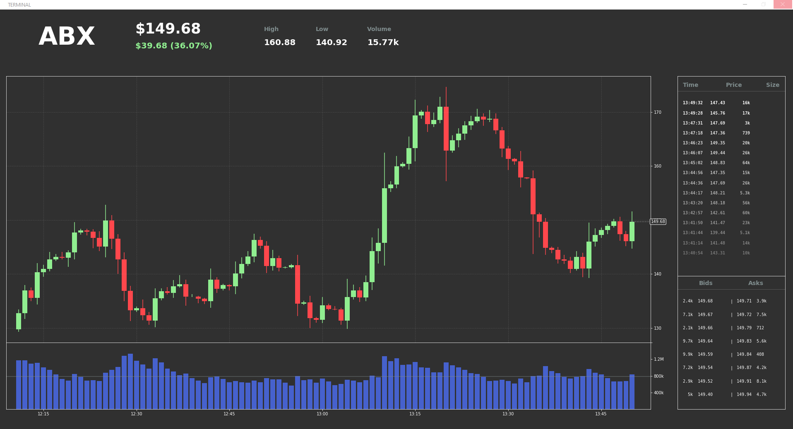

## Stock Terminal Simulator
This tool creates a window that displays a simulated stock terminal. The screen is divided into several widgets that display information about the stock. The price history of the stock is simulated along with trade volume, volatility, and trade history.

## Documentation
To view documentation, view the files in the `docs/` folder.

## Installation
This repo is configured to be installed using `git clone`. There are plans to update this repo to allow it to be installed and run via an executable.

To install, use
```
git clone https://github.com/BaileyRobison/stock_terminal_simulator.git
```

To run, use the code in `main.py`.


The tool will display a terminal window which will update over time, shown below.


